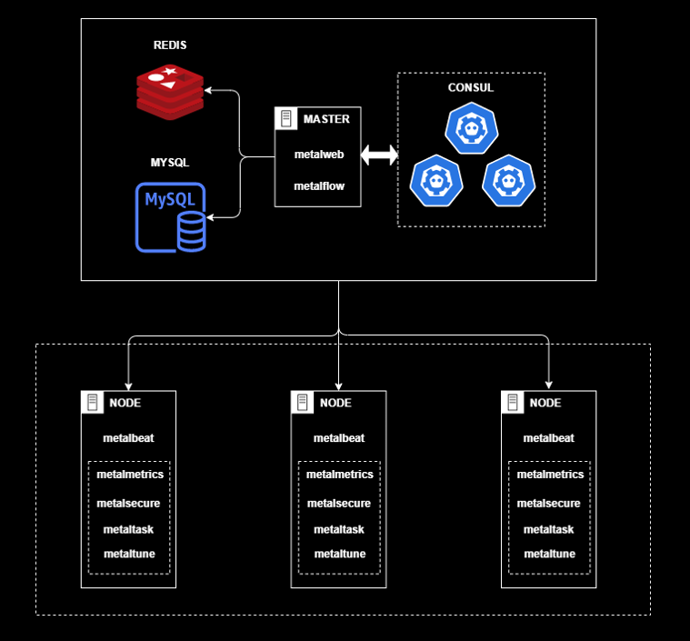

# 架构

`磐石`系统由多个部分构成，各个部分各司其职，并又相互交互协调。

从图中可以看出，一台主机专门可用来部署前端 `metalweb` 和后端 `metalflow` 服务（也可各用一台主机部署）。

磐石系统作为主流的前后端分离项目，前端用来部署网页与用户进行交互。后端则搭配 MySQL 数据库（存储服务器指标数据等），Redis 作为消息队列（执行操控服务器的相关任务），与`服务注册中心`[consul 集群](https://developer.hashicorp.com/consul/docs/intro) 进行通信从而发现已被注册的服务器。

每台服务器上需要部署 `metalbeat`，它以 [sidecar 模式](https://learn.lianglianglee.com/%E4%B8%93%E6%A0%8F/%E5%B7%A6%E8%80%B3%E5%90%AC%E9%A3%8E/060%20%20%E7%AE%A1%E7%90%86%E8%AE%BE%E8%AE%A1%E7%AF%87%E4%B9%8B%E8%BE%B9%E8%BD%A6%E6%A8%A1%E5%BC%8F.md) 提供接口，使服务器可以与后端 `metalflow` 进行交互，并将该服务器注册到 `consul` 集群中。

`metalmetrics`、`metalsecure`、`metaltask` 和 `metaltune` 作为 `workers` 可以按需部署在服务器上，以暴露更多的接口与后端 `metalflow` 进行交互。通过这些 `workers` 可以增强对服务器的管理。

这些 `workers` 各司其职：

- **metalmetrics**：获取服务器的基本信息，例如: CPU、硬盘、MAC 地址、内存和显卡等信息。
- **metalsecure**：获取服务器和其上运行的 `Docker` 容器的 `SBOM` 和 `Vulnerability` 报告信息。
- **metaltask**：接收前端用户传递到该服务器上的文件，若文件为可执行文件，还提供直接运行功能。
- **metaltune**: 对服务器进行场景定制和性能调优等。
