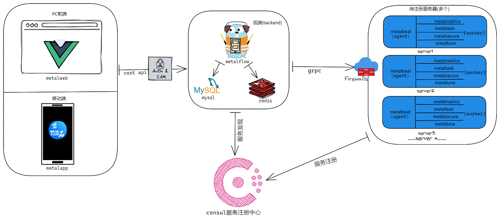

# 介绍

## 背景

在企业或组织管理大量服务器时，经常会遇到以下问题：

- 服务器种类繁杂、数量庞大
- 服务器系统安装、维护、更新时工作量巨大
- 人工无法保证时效性和准确性

这造成了对服务器的管理混乱，浪费大量的人力和资源成本，且对部署在服务器上的业务造成安全隐患，无法对业务的稳定运行保驾护航。

鉴于此，亟需一款可以全面呈现服务器状态、方便快捷管控服务器的系统。`磐石`应运而生。

## 用途

`磐石`是一款服务器管理系统，它基于`服务发现`特性，实时监控统计大量服务器的状态与性能指标。开发经理、`DevOps`工程师和开发工程师都可以使用它：

- 全面详细地了解服务器状态，得到服务器的健康度、性能以及运行情况的立体测评结果。
- 方便快捷地在浏览器内直连服务器节点，实时访问、批量运维，提升交互体验。
- 智能细致地对服务器参数调优，突破性能瓶颈。
- 聚焦端到端的访问管控，守护合规安全。

## 设计

`磐石`系统的整体设计部分如下图所示：

- **用户交互端**：分为 PC 端和移动端，用户可通过网页或小程序与系统进行交互。
- **服务端**：主要用来暴露 API 给 PC 端和移动端，并对服务器节点监控、交互。
- **待注册服务器**：向服务注册中心注册自己，并部署若干服务 `worker` 供后端调用。
- **服务注册中心 consul**：管理并监控注册的服务器节点。
